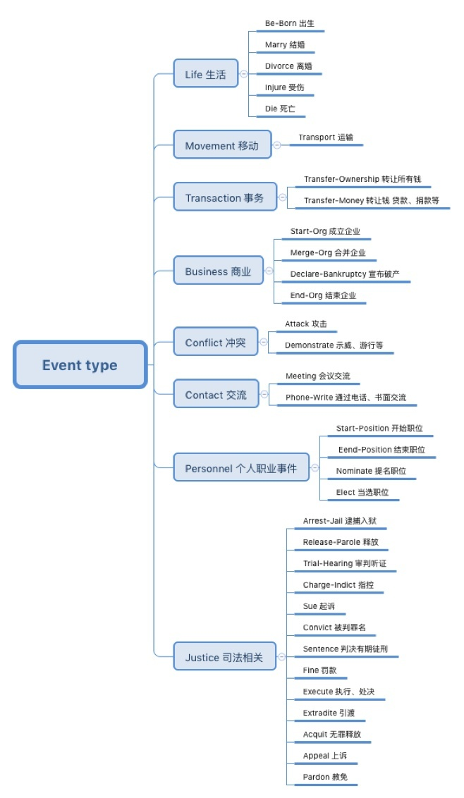
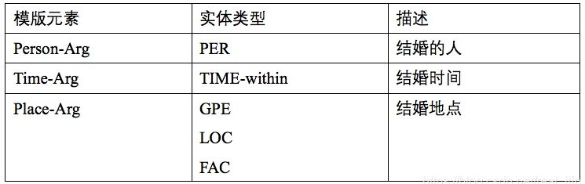
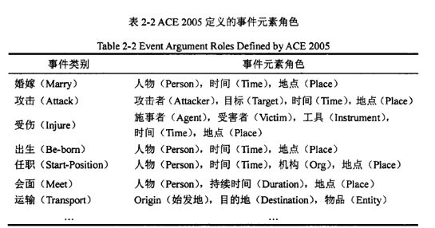

# ACE2005 dataset

## Description

ACE 2005 Multilingual Training Corpus contains the complete set of English, Arabic and Chinese training data for the 2005 Automatic Content Extraction (ACE) technology evaluation. The corpus consists of data of various types annotated for entities, relations and events by the Linguistic Data Consortium (LDC) with support from the ACE Program and additional assistance from LDC.

## Examples

## Licenses

The official buying link can be found at: https://catalog.ldc.upenn.edu/LDC2006T06

